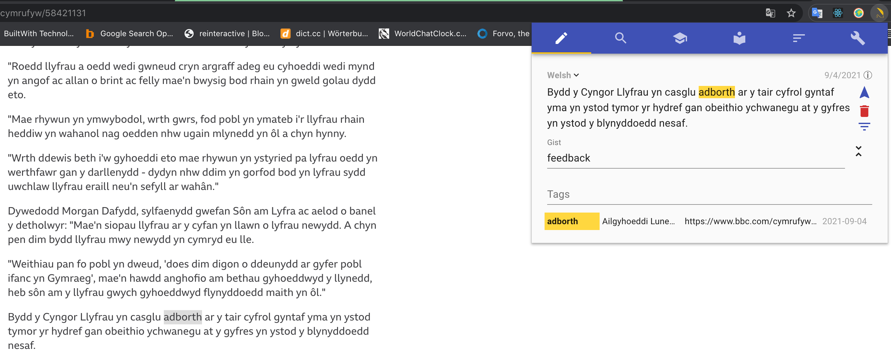

# Amanuensis

This project is a browser extension to facilitate taking notes on web pages. It was originally conceived
as a language learning aid, but really it is suitable for any sort of note.

## Basic Procedure

The basic procedure is that you take notes, retrieve notes, and, if you are using them as a learning aid, review them.

### Taking a note

You see something on a page you want to take a note on. You select and press alt/option-a (⌥a). A note is generated with this
text highlighted and embedded in its context. The time, URL, and page title are recorded. You can add text or tags.

I use Amanuensis together with the
[Google translate extension](https://chrome.google.com/webstore/detail/google-translate/aapbdbdomjkkjkaonfhkkikfgjllcleb).
There are undoubtedly other worthy extensions and websites that can server a similar function. If you are less lazy, a paper
dictionary works quite well.

### Finding a note

The second tab allows you to search for saved notes.

### Testing your knowledge

You can turn search results into a flashcard stack. You review one side of a card:

Then flip it and rate your recall:

After each card you click the blue arrow (or use the keyboard shortcut) to advance to the next card. Amanuensis first tests
you on the "front" of each card, then flips the stack and tests you on the back. If you succeed on both sides the card is
removed from the stack. Once you've successfully remembered both sides of all the cards there is a small celebration.

## Further Information

I hesitate to go into great detail in this README. Documentation of this sort tends to drift out of sync with
the code. Inside Amanuensis itself you will find a liberal sprinkling of question marks in bubbles:

If you click these contextual informational sections will expand. Click them again and these sections will disappear.

On the note tab itself, for reasons of space, an "i" in a bubble is used instead:

## Installation

I'll update this when I've uploaded this to the Chrome extension store.

## Technology

Amanuensis is written in Typescript using React and Material-UI. Aside from
[canvas-confetti](https://www.npmjs.com/package/canvas-confetti/v/1.0.0) it has few dependencies.

## Privacy and Security

The notes you create are saved on your machine and are available only within the browser (though you can export them).
You need internet connectivity to use Amanuensis only to retrieve the pages on which you wish to take notes. No information
regarding Amanuensis is transmitted to any other machine, service, or process. To move notes between machines or browsers
you must download them as JSON file and then upload that file to the other browser.

## Cost

Amanuensis is free. There are no usage tiers or plans to introduce them. Though if you feel inclined to
[give me a tip](https://www.buymeacoffee.com/dfhoughton) I won't take it amiss.

## Known Problems

Amanuensis consists of three pieces of code that communicate with each other:
- code running on the page that listens for highlighting events to allow the taking of notes
- code producing the extension itself
- code running in the background to pass messages between the first two so the extension code can create notes on whatever's highlighted when Amanuensis is invoked

For reasons I have not tracked down, the first bit, the code running on the page, sometimes stops or becomes unresponsive. This does not seem to involve an error that is logged anywhere. If you find that you open Amanuensis but Amanuensis hasn't prepared a note for you on whatever you've highlighted, you have encountered this issue. You can fix this by reloading the page.

## Acknowledgements and Confessions

I have written this by myself. I've gotten and patient toleration from my family and co-workers. Also
- My son Jude has worked on making this extension function in Firefox.
- My daughter Ada created the writing quill icon and approved my color choices.

This is the first significant piece of work I've done in React and Typescript. Undoubtedly some of it could
be done better. If time allows it will eventually be done better.
